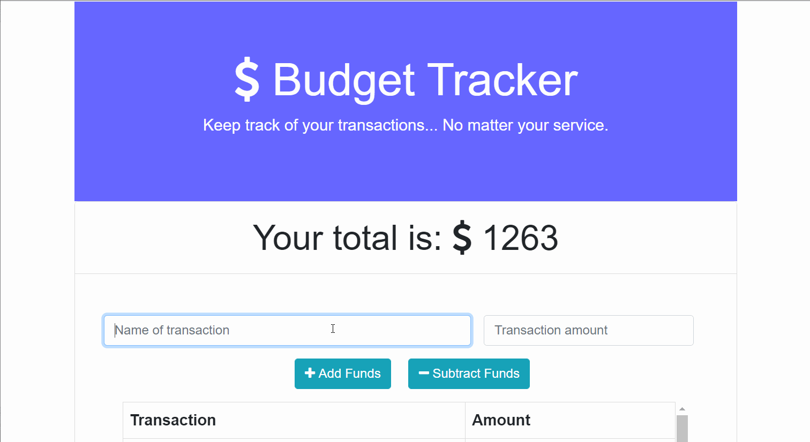

# Budget Tracker

## Description
Enter your expenses and income into the budgeting app for a quick visual of your funds. The app will automatically update the expense chart and graph. If you are offline, it will update the app with the cached data until you get back online.

## Table of Contents
* [Deployed Link](#deployed-link)
* [Installation](#installation)
* [Usage](#usage)
* [License](#license)
* [Author](#author)
* [Questions](#questions)
* [Acknowledgements](#acknowledgements)

## Deployed Link
[Deployed on Heroku](https://enigmatic-ridge-41605.herokuapp.com/)

## Installation
If you wish to clone the code locally, you will need to run
`npm install` to install the dependecies listed in the package.json. 

## Usage
Used the deployed site provided above.
Or if cloning locally, run `npm start` after the dependencies have been installed.

## License

## Author
Haley Myers

## Questions
Please email [haleynmyers@gmail.com](mailto:haleynmyers@gmail.com)

## Acknowledgements
Routes and models provided by Trilogy Education

